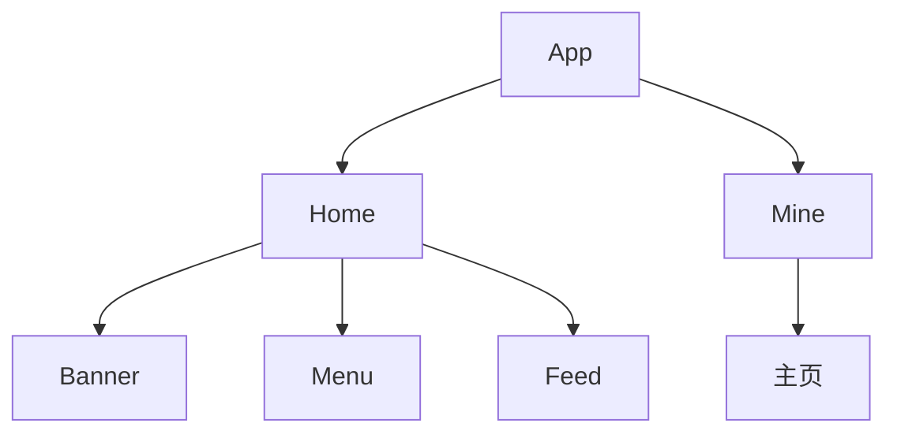

# iOS应该如何划分模块

根据业务进行模块划分，一个业务对应一个模块，如果这个模块里面又有很多独立的小业务，那就再划分子模块。

可以看上面这个流程图，首先，App分为了两个大模块，Home，Mine，Home下面又有小模块，那么，我们就可对小模块进行一个拆分，细分为Banner，Menu和Feed。当然，如果Banner的业务如果比较多的话，我们还可以进行拆分，再分为更细的小模块，逐渐形成一个树状结构。

这样子的话，就可以把不同的业务拆分成不同的小模块，如果复用的话，我们也是进行业务上的复用，就不用管模块内部的代码实现。

划分模块的话，要保持以下几种原则：

* 模块之间的独立，模块与模块之间互不影响
* 父模块通过子模块暴露的接口进行对子模块的调用，子模块不持有父模块
* 模块与模块之间，通过接口进行相互调用，相互不持有对方